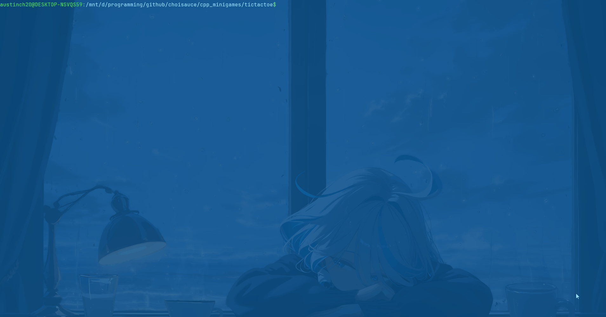
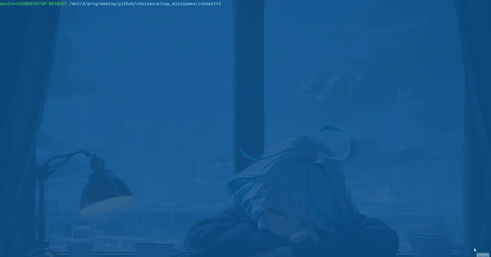
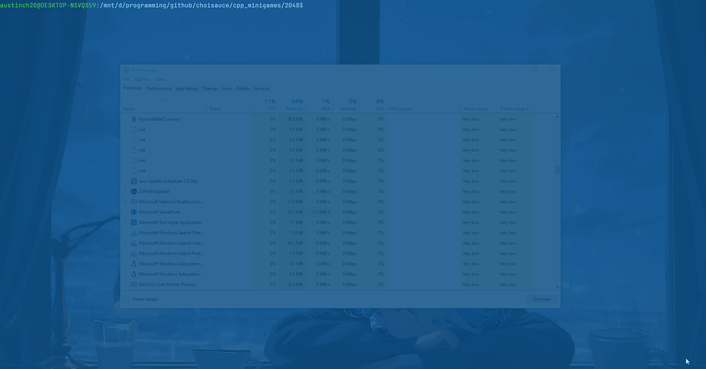
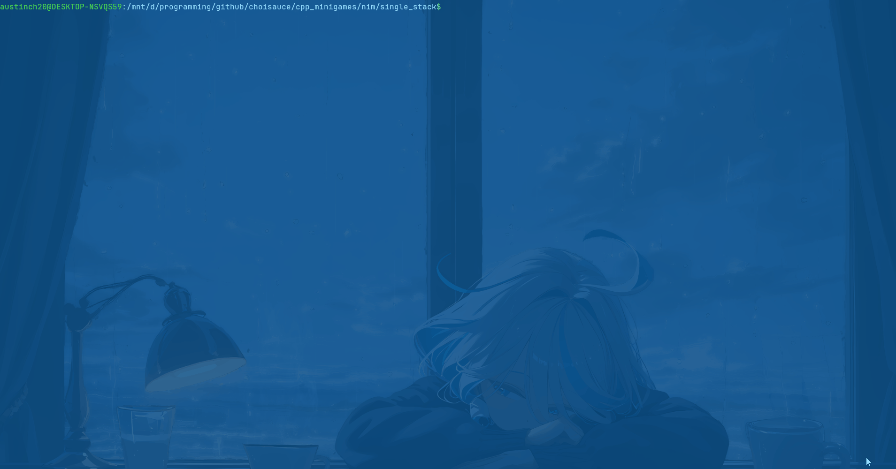

# C++ Minigames

# Table of Contents
* [About](#about)
* [Tic Tac Toe](#tic-tac-toe)
* [Connect 4](#connect-4)
* [2048](#2048)
* [Nim](#nim)

# About
## A collection of terminal minigames
- Tic Tac Toe
- Connect 4
- 2048
- Nim

# Games

## Tic Tac Toe
You can find the Tic Tac Toe game found in /tictactoe directory
To play the game, first compile the main.cpp file and run the executable



Linux/Mac
```sh
g++ main.cpp
./a.out
```

Windows
Use a c++ compiler? Probably cygwin through clion or visual studio? Sorry not a windows dev lol (Will look into it more)

## Connect 4
You can find the Connect 4 game found in /connect4 directory
To play the game, first compile the main.cpp file and run the executable



Linux/Mac
```sh
g++ main.cpp
./a.out
```

Windows
Use a c++ compiler? Probably cygwin through clion or visual studio? Sorry not a windows dev lol (Will look into it more)

## 2048
You can find the 2048 game found in /2048 directory
To play the game, first compile the main.cpp file and run the executable



Linux/Mac
```sh
g++ main.cpp
./a.out
```

Windows
Use a c++ compiler? Probably cygwin through clion or visual studio? Sorry not a windows dev lol (Will look into it more)
Make sure to compile the `windowsMain.cpp` file since this allows for unbuffered arrow key input.

## Nim
You can find the nim game found in /nim/single_stack directory
To play the game, first compile the main.cpp file and run the executable



Linux/Mac
```sh
g++ main.cpp
./a.out
```

Windows
Use a c++ compiler? Probably cygwin through clion or visual studio? Sorry not a windows dev lol (Will look into it more)

Copyright &copy; 2025 Choice404
